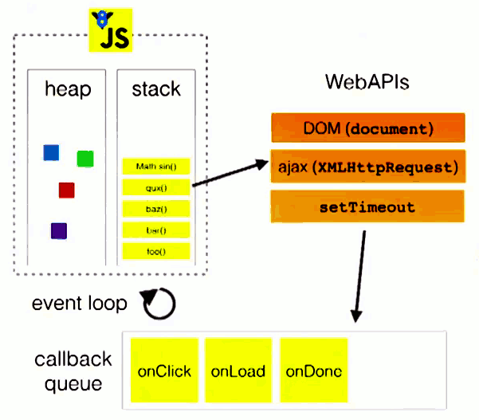
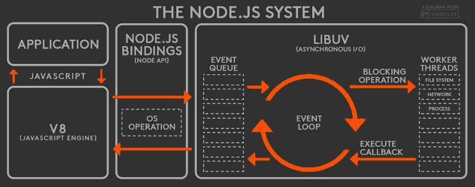
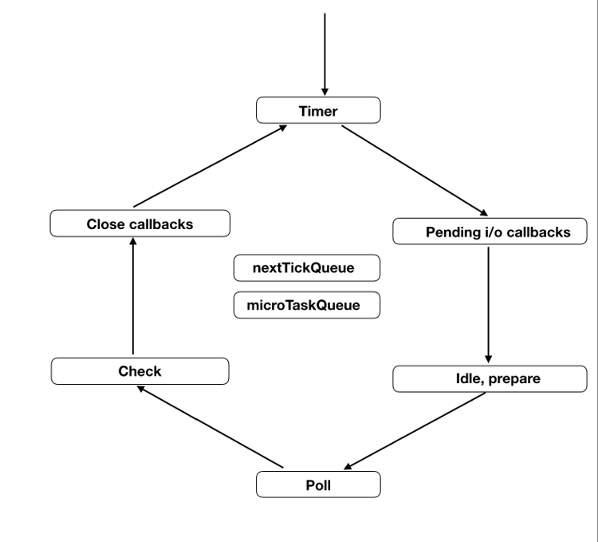
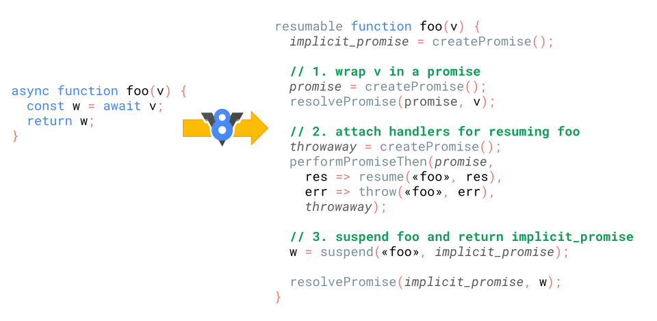
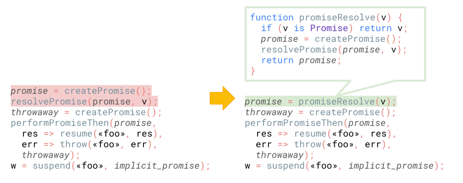

## javescript的事件循环
要说javescript的事件循环，就要从js的单线程说起
<!-- more -->

-------

### 为什么js是单线程？
js的单线程与他用途有关。js的主要用途是与用户交互，以及操作DOM，这决定了它只能是单线程。

-------


### 任务队列
单线程就意味着，所有任务需要排队，前一个任务结束，才会执行后一个任务。如果前一个任务耗时很长，后一个任务就不得不一直等着。但是很多时候CPU是闲着的，因为IO设备（输入输出设备）很慢（比如Ajax操作从网络读取数据），不得不等着结果出来，再往下执行。

所以主线程完全可以不管IO设备可以挂起处于等待中的任务，先运行排在后面的任务。等到IO设备返回了结果，再回过头，把挂起的任务继续执行下去。

于是，所有任务可以分成两种，一种是同步任务（synchronous），另一种是异步任务（asynchronous）。

异步执行机制（同步执行也是如此）：

- 所有同步任务都在主线程上执行，形成一个执行栈。
- 主线程之外，还存在一个"任务队列"（task queue）。只要异步任务有了运行结果，就在"任务队列"之中放置一个事件。
- 一旦"执行栈"中的所有同步任务执行完毕，系统就会读取"任务队列"，看看里面有哪些事件。那些对应的异步任务，于是结束等待状态，进入执行栈，开始执行。
- 主线程不断重复上面的第三步。

 
关于任务队列再补充几点

* **任务队列**中的事件只要指定过**回调函数**，这些事件发生时就会进入**任务队列**，队列又细分为宏队列和微队列，其中包含的任务被称为宏任务和微任务。**回调函数**就是会被主线程挂起来的代码。
* **任务队列**是一个先进先出的数据结构
* 主线程读取任务队列基本上是自动的，只要执行栈清空，**任务队列**上第一个事件就自动进入主线程

-------

### 事件循环
*主线程从"任务队列"中读取事件，这个过程是循环不断的，所以整个的这种运行机制又称为Event Loop（事件循环）。*

这边有一个很重要的点就是:
**执行栈中的代码总是在读取任务队列之前执行**



主线程运行的时候，产生堆（heap）和栈（stack），栈中的代码调用各种外部API，它们在"任务队列"中加入各种事件（click，load，done）。只要栈中的代码执行完毕，主线程就会去读取"任务队列"，依次执行那些事件所对应的回调函数。

``` javascript
var req = new XMLHttpRequest();
req.open('GET', url);
req.send();
req.onload = function (){};    
req.onerror = function (){};   
```

`req.onload`和`req.onerror`在`send()`的前后无关紧要，因为他们是执行栈的一部分，只有执行完他们，才会去读取`send()`加入任务队列中的回调函数

#### Node.js的事件循环


Node.js的运行机制如下
1. V8引擎解析js
2. 解析代码后，调用Node的API
3. libuv库负责Node API的执行。它将不同任务分配给不同队列形成事件循环，以异步方式将任务执行结果返回给V8引擎
4. V8引擎再将结果返回给用户


Node.js的事件循环与浏览器不一样，它每一轮事件循环分6个部分，依次执行。每个阶段都有一个先进先出的回调函数队列。只有一个阶段的回调函数队列清空了，该执行的回调函数都执行了，事件循环才会进入下一个阶段。


- timmer:这个是定时器阶段，处理setTimeout()和setInterval()的回调函数。进入这个阶段后，主线程会检查一下当前时间，是否满足定时器的条件。如果满足就执行回调函数，否则就离开这个阶段。
- I/O callbacks: 这个阶段执行一些系统操作的回调。比如TCP错误，如一个TCP socket在想要连接时收到ECONNREFUSED, 类unix系统会等待以报告错误，这就会放到 I/O callbacks 阶段的队列执行。
- idle,prepare:该阶段只供 libuv 内部调用，这里可以忽略。
- Poll:这个阶段是轮询时间，用于等待还未返回的 I/O 事件，比如服务器的回应、用户移动鼠标等等。这个阶段的时间会比较长。如果没有其他异步任务要处理（比如到期的定时器），会一直停留在这个阶段，等待 I/O 请求返回结果。
- check: `setImmediate`在这个阶段执行
- close callbacks：该阶段关闭请求的回调函数

``` javascript
var fs = require('fs');

function someAsyncOperation (callback) {
  // 假设这个任务要消耗 95ms
  fs.readFile('/path/to/file', callback);
}

var timeoutScheduled = Date.now();

setTimeout(function () {

  var delay = Date.now() - timeoutScheduled;

  console.log(delay + "ms have passed since I was scheduled");
}, 100);


// someAsyncOperation要消耗 95 ms 才能完成
someAsyncOperation(function () {

  var startCallback = Date.now();

  // 消耗 10ms...
  while (Date.now() - startCallback < 10) {
    ; // do nothing
  }

});
```

1. 在timmer阶段`setTimeout`还没有到设置的时间，不会执行回调
2. 进入Poll阶段，读取文件用时95ms，然后执行回调，在回调执行到一半，100ms的定时器到期，但是必须等这个回调执行完毕才会离开这个阶段
3. 执行`setTimeout`回调，打印出105ms


### 宏任务和微任务

先通过一张图片来了解宏任务与微任务的关系


1. 执行全局同步代码
2. 全局代码执行完毕后，调用栈会清空
3. 从微任务中取出队首的回调任务，放入调用栈执行
4. 继续取出微任务队首任务放入执行栈执行，以此类推，直到微任务队列全部执行完毕。如果再执行微任务过程中，又产生微任务，会加到这个周期的微任务末尾，也在这个周期执行
5. 微任务全部执行完毕，此时微任务队列为空，调用栈也为空，去除宏队列中队首的任务，放入执行栈执行
6. 执行完毕后，调用栈为空
7. 重复3-7步骤

#### 宏任务
宏任务最常见的例子就是定时器：`setTimeout()`和`setInterval()`


``` javascript
console.log(1)

setTimeout(function(){
  console.log(2)
},0)

console.log(3)

执行结果：// 1 3 2
```

上面的例子中，`setTimeout`注册了一个宏任务，等执行栈全部执行完后，再从宏任务中取出并执行。

#### 微任务
**微任务总是在宏任务之后执行，微任务没有执行完成，不会执行下一个宏任务**
微任务的代表就是`Promise`

``` javascript
setTimeout(_ => console.log(4))

new Promise(resolve => {
  resolve()
  console.log(1)
}).then(_ => {
  console.log(3)
})

console.log(2)
 执行结果 // 1 2 3 4
```
`Promise`在实例化过程中是同步进行的，二`then`中注册的回调函数加入微任务中，在执行栈执行完当前同步代码再去查看是否有微任务，执行完微任务才执行宏任务，以此循环

因此可以预见在`Promise`中实例化`Promise`，其输出依然会早于`setTimeout`

``` javascript 
setTimeout(_ => console.log(6))

new Promise(resolve => {
  resolve()
  console.log(1)
}).then(_ => {
  console.log(3)
  Promise.resolve(
    console.log(4)
  ).then(_ => {
    console.log('before timeout')
  }).then(_ => {
    Promise.resolve(
      console.log(5)
    ).then(_ => {
      console.log('also before timeout')
    })
  })
})

console.log(2)
```
以上输出顺序就是按照数字顺序


#### 补充
下面举几个特殊例子
`requestAnimationFrame`在MDN上的定义是:*告诉浏览器——你希望执行一个动画，并且要求浏览器在下次重绘之前调用指定的回调函数更新动画*
看下面例子
  
``` javascript
    setTimeout(function () {
        console.log(1)
    }, 0)
    var timer = requestAnimationFrame(function () {
        console.log(2)
    })
    new Promise(resolve => {
        resolve();
        console.log(3)
    }).then(function () {
        console.log(4)
    })
    输出顺序 //3 4 2 1
```
由上代码输出结果可以看出**requestAnimationFrame**实际在微任务后执行，但是又在宏任务之前，从MDN定义来看，重绘是作为宏任务的一个步骤存在的，暂且列为宏任务

`requestAnimationFrame`可以解决定时器写的动画对网页性能的影响，因为它是在每一次重新渲染页面的时候执行，所以不会像定时器可能会在同一次渲染中多次执行修改页面的代码，也不会因为间隔时间过长引起动画不流畅


* **requestIdleCallback**在MDN上的定义:*会在浏览器空闲时依次调用函数*
  看如下例子
  
  ``` javascript
  var timer = requestIdleCallback(function () {
      console.log(2)
    })
setTimeout(function () {
      console.log(1)
    }, 0)
    
    new Promise(resolve => {
      resolve();
      console.log(3)
    }).then(function () {
      console.log(4)
    })
    输出顺序 //3 4 1 2
  ```
其实`requestIdleCallback`无论放在哪都是最后输出
这里我们看一下关于`requestIdleCallback`的深度解释：**只有当一帧的末尾有空闲时间，才会执行回调函数**，我们都知道网页一秒运行60帧，也就说一帧运行时间小于16.7ms才会运行`requestIdleCallback`的回调函数,我们对上面代码做如下改动

``` javascript
    var timer = requestIdleCallback(function () {
      console.log(2)
    },{timeout:100})
    setTimeout(function () {
      console.log(1)
    }, 100)
    
    new Promise(resolve => {
      resolve();
      console.log(3)
    }).then(function () {
      console.log(4)
    })
    输出顺序 // 3 4 2 1
```
配置timeout是如果在规定的时间内没有可以运行的帧，到了规定时间就强制执行`requestIdleCallback`中的回调，不过在实际运行中就已经造成页面的卡顿了

如上代码是在我浏览器上运行，这个代码执行顺序直接跟浏览器性能有关，如果Promise的运行时间小于我设施的setTimeout的时间，`requestIdleCallback`就会先于setTimeout执行。废话说了这么多，其实就是为了证明requestIdleCallback是在微任务之后执行的宏任务

`requestIdleCallback`适合在页面滚动时使用，这样执行的代码不会引起页面滚动的卡顿

* **MutationObserver**在MDN的定义为:*提供了监视对DOM树所做更改的能力*

``` javascript 
const $inner = document.querySelector('#inner')
const $outer = document.querySelector('#outer')

function handler () {
  console.log('click') // 直接输出

  Promise.resolve().then(_ => console.log('promise')) // 注册微任务

  setTimeout(_ => console.log('timeout')) // 注册宏任务

  requestAnimationFrame(_ => console.log('animationFrame')) // 注册宏任务

  $outer.setAttribute('data-random', Math.random()) // DOM属性修改，触发微任务
}

new MutationObserver(_ => {
  console.log('observer')
}).observe($outer, {
  attributes: true
})

$inner.addEventListener('click', handler)
$outer.addEventListener('click', handler)
输出结果 //
 click
 promise
 observer
 click
 promise
 observer
 2* animationFrame
 2* timeout
```

以上是一段包含`MutationObserver`的代码，从运行结果可以看出执行顺序如下:
1. 点击的I/O事件会将inner和outer的回调注册为宏任务，先触发inner的handler，打印click
2. 发现其中有promise优先注册为微任务，setTimeout和requestAnimationFrame注册为宏任务，setAttribute修改了attributes触发MutationObserver注册为微任务
3. 执行微任务promise和observer后发现没有微任务了
4. 执行outer注册的宏任务，重复第二部流程
5. 因为第二步修改了DOM的attributes，导致页面重绘，所以requestAnimationFrame的回调先执行，然后执行setTimeouter
6. 执行outer中的宏任务，重复第五步流程

* **setImmediate**在MDN中解释为：*该方法用来把一些需要长时间运行的操作放在一个回调函数里,在浏览器完成后面的其他语句后,就立刻执行这个回调函数*

``` javascript 
setTimeout(() => console.log(1));
setImmediate(() => console.log(2));
```
上面代码输出顺序是不确定的，因为在实际执行的时候，进入事件循环以后，有可能到了1毫秒，也可能还没到1毫秒，取决于系统当时的状况。如果没到1毫秒，那么 timers 阶段就会跳过，进入 check 阶段，先执行setImmediate的回调函数。

``` javascript
const fs = require('fs');

fs.readFile('test.js', () => {
  setTimeout(() => console.log(1));
  setImmediate(() => console.log(2));
});
```
但是这样改进后，2一定在1之前打印，因为先进入I/O callback阶段，然后是check阶段，在第二轮循环才轮到timmer阶段

* **process.nextTick**是定义一个动作，在下一轮事件轮询时执行，微任务追加在其后面。
`process.nextTick`执行比较特殊，无论事件循环在何种阶段，都会在结束时执行

``` javascript
setTimeout(() => console.log(1));
setImmediate(() => {
  process.nextTick(() => console.log(6));
  console.log(2)
});
process.nextTick(() => console.log(3));
Promise.resolve().then(() => console.log(4));
(() => console.log(5))();
// 打印 5 3 4 1 2 6
```


* **总结**
 
    **宏任务:I/O，定时器，setImmediate，requestAnimationFrame**
    **微任务：MutationObserver，Promise.then，process.nextTick**

#### 延伸
**异步函数**是一个使用隐式 Promise 异步操作以返回其结果的函数。异步函数旨在使异步代码看起来像同步代码，为开发者隐藏异步处理的一些复杂性。

通常传递`Promise`给`await`，但是实际上可以传任意值给`await`，因为`await`会将任意值转成`Promise`

``` javascript
async function foo() {
  const v = await 42;
  return v;
}

const p = foo();
// → Promise

p.then(console.log);
// prints `42` eventually
```

`await`可以使用任何`thenable`

``` javascript
class Sleep {
  constructor(timeout) {
    this.timeout = timeout;
  }
  then(resolve, reject) {
    const startTime = Date.now();
    setTimeout(() => resolve(Date.now() - startTime),
               this.timeout);
  }
}

(async () => {
  const actualTime = await new Sleep(1000);
  console.log(actualTime);
})();
```

现在有趣的来了

``` javascript
const p = Promise.resolve();

(async () => {
  await p; console.log('after:await');
})();

p.then(() => console.log('tick:a'))
 .then(() => console.log('tick:b'));
```

上面代码的输出顺序其实是错误的，`then`关联到一个已经`fulfilled`的`Promise`上，V8引擎的一个BUG导致上面的代码`await`跳过了微任务，先打印出了`after:await`。

官方给的解释是*这个 bug 的原因是我们违反了 es 的规范，但它后来给了我们关于优化的灵感。*



可以看到其实在await的实现中，不论传参是什么，都会再包一层promise，因此事件被加入了下一次的task中，所以导致了输出顺序问题。
分析一下`await`具体做了什么操作：
1. 将 v 转换为 Promise- v 代表传递给 await 的值。
2. 给 Promise 附加处理程序以便稍后恢复异步函数。
3. 挂起异步函数并返回 implicit_promise 给调用者。
从性能角度分析，第一步多创建了`Promise`包装器，然后立即解析`Promise`包装器v的值，这两行多创建了一个`Promise`，同时创建`Promise`会导致一个额外的`PromiseReactionJob`，`resolvePromise`会导致一个额外的`PromiseResolveThenableJob`



而改进过后，会在包装Promise的时候先判断传入的是不是一个Promise对象，如果是直接沿用这个Promise，从而减少了创建的promise数量和微任务的数量。`throwaway`是为了恢复foo的执行，因此优化之后的`await`就只创建这一个新的`Promise`

内容参考:

*  MDN WEB 文档
*  \<\<ES6标准指南>\>(阮一峰)
* [阮一峰博客：网页性能详解](http://www.ruanyifeng.com/blog/2015/09/web-page-performance-in-depth.html)
* segmentfault中的全沾开发(huā) [https://segmentfault.com/a/1190000016022069#articleHeader11](https://segmentfault.com/a/1190000016022069#articleHeader11)
* [v8引擎中文官网(更快的异步函数和 Promise)](https://v8.js.cn/blog/fast-async/)


